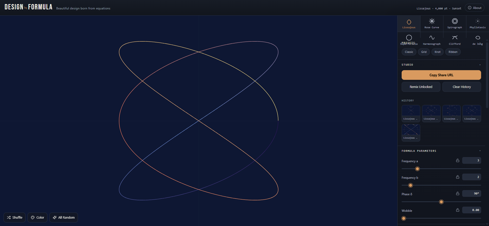
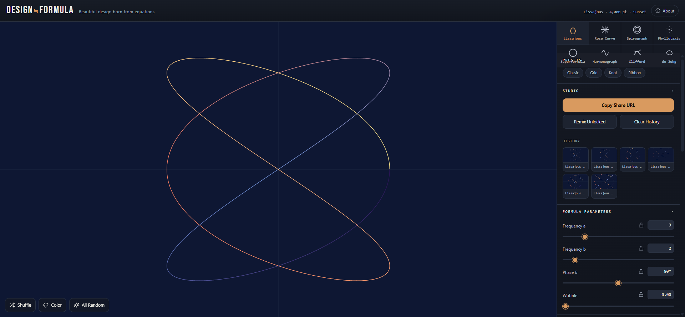

# VECTRA

Beautiful designs born from mathematics.

VECTRA is a free, browser-based pattern generator that turns mathematical formulas into geometric artwork. Move sliders, pick colors, shuffle, and export — no math degree, registration, or installation required.




## Features

- **8 pattern systems** — Lissajous, Rose Curve (Rhodonea), Spirograph (hypotrochoid), Phyllotaxis, Superformula, Harmonograph, Clifford attractor, and de Jong attractor
- **Real-time controls** — every parameter is a live slider with instant visual feedback, plus curated presets per pattern
- **18 color palettes** — with custom gradient editor and 4 color modes: Sequence, Center Distance, Velocity, Solid
- **Smooth morphing** — switching patterns or parameters animates fluidly between states (toggleable, speed adjustable)
- **Lock & shuffle** — lock the values you like, randomize the rest; plus "Remix Unlocked" and full-random modes
- **SVG & PNG export** — editable 1000×1000 vector SVG, 3000×3000 PNG, or a simplified single-path SVG for line art
- **Shareable URLs** — the entire design state is encoded in the URL hash; one link reproduces the exact pattern
- **Design history** — your last 8 designs are saved locally (localStorage) with thumbnails for quick restore
- **Mobile-friendly** — touch-optimized UI; long-press exported images to save them on mobile

## Pattern types

| Pattern | Description |
|---|---|
| Lissajous | Two orthogonal sinusoidal oscillations combined; frequency ratio and phase produce elegant knot-like lattices |
| Rose Curve (Rhodonea) | Polar equation `r = cos(k·θ)` creates petal-shaped curves; one coefficient changes the petal count |
| Spirograph (Hypotrochoid) | Trace of a pen attached to a smaller circle rolling inside a larger one — dense, lace-like gear patterns |
| Phyllotaxis | Points arranged along the golden angle, mimicking sunflower seed spirals |
| Superformula | Gielis' superformula — stars, flowers, and polygons from a single equation |
| Harmonograph | Damped trace of coupled pendulums; gradually decaying oscillations close into poetic spirals |
| Clifford attractor | Chaotic iterative point cloud with cloud- and feather-like density gradients |
| de Jong attractor | Another strange attractor family; butterfly-like or misty organic forms |

## Getting started

No build step, no dependencies, no external CDNs — pure HTML, CSS, and vanilla JavaScript. Just serve the folder:

```bash
git clone <repository-url>
cd vectra
python3 -m http.server 8000   # or any static file server
```

Then open <http://localhost:8000>. Serving over `localhost` (or HTTPS) is recommended so the **Copy Share URL** button works — it uses the Clipboard API, which requires a secure context.

## Project structure

```
├── index.html        # The generator
├── about.html        # Features, usage guide, FAQ
├── license.html      # Third-party license overview
├── css/              # Styles (style.css, about.css)
├── js/               # main.js (generator), about.js (about-page background)
├── common/           # Self-hosted fonts (Bebas Neue, Geist Sans) + licenses
├── screenshot.png    # Generator screenshot
└── screenshot-about.png  # About page screenshot
```

## License

- The tool is free to use, and generated patterns (SVG/PNG) may be used freely in your own work — see the disclaimer in [about.html](about.html).
- Third-party assets in this repository: **Bebas Neue** (SIL Open Font License 1.1) and **Lucide icons** (ISC License). Details in [license.html](license.html) and `common/LICENSES/`.

Made by [ASOBOAD](https://amix-design.com/asoboad/).
